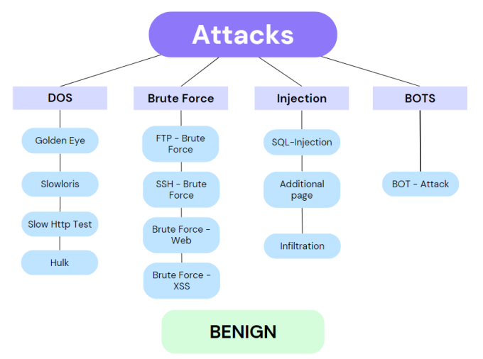
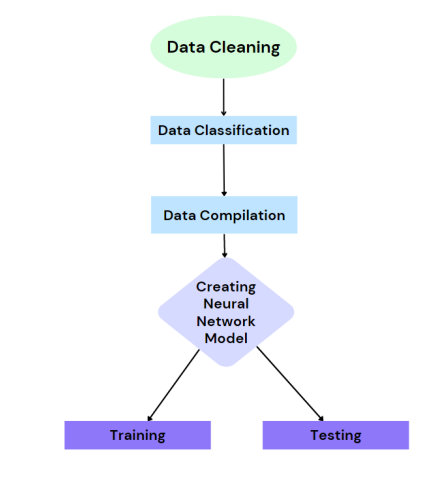
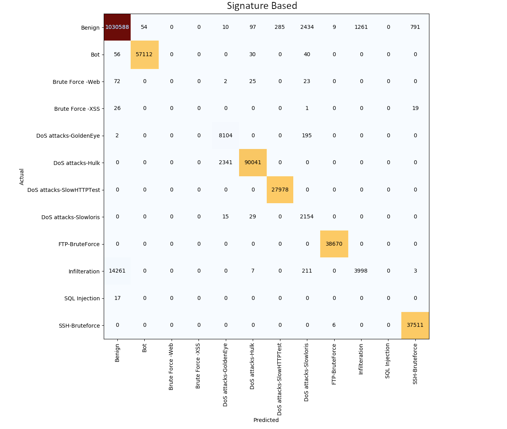
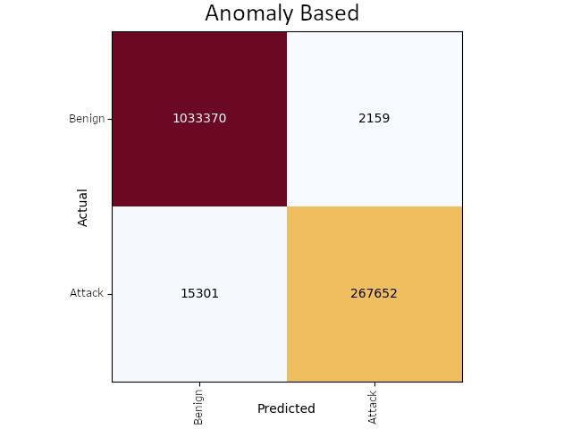

<h1 align="center">

</h1> 

# Network Intrusion Detection System
In today's digital age, safeguarding organizational data is critical, and network security is a major expense in this effort. Our project enhances this security layer with a sophisticated Intrusion Detection System (IDS), utilizing a neural network trained on the comprehensive KDD dataset. This system analyzes millions of network packets—including TCP, UDP, and ICMP types—to detect and classify 10 different attack patterns with high precision. I personally developed a model with an architecture featuring 79 neurons in the input layer and 12 in the output, running through 6 million packets for accurate classification. After extensive data cleaning to remove any corrupted data, our model achieves an impressive 95.43% accuracy for signature-based detection and 97.94% for anomaly detection, maintaining low false positive and negative rates. This robust system not only strengthens network defenses but also ensures continuous adaptation to evolving threats.

# Model Architecture
<h1 align="center">

</h1> 

## 🔑 Key Achievements

### Data Cleaning
- Iterated through each file to remove rows with "NaN", "Inf", or empty values, ensuring data integrity.
  
### Data Classification and Compilation
- Combined multiple CSV files containing various packet types and attack signatures.
- Organized the data into two distinct files: one for signature-based and another for anomaly-based analysis.

### Neural Network Creation
The Neural network was built using Keras and Tensorflow library
- Input Layer: The neural network starts with an input layer of 79 neurons, activated by the 'relu' function, determined dynamically by the input data dimension.
- Hidden Layer: with 128 neurons, also using 'relu' activation.
- Output Layer: The final layer's neuron count and activation function depend on the classification type (binary or categorical).
- For binary classification, the activation is 'softmax' for more than two categories, and the loss function is set accordingly:
  - Binary cross-entropy for binary outputs.
  - Categorical cross-entropy for multi-class outputs.
- Model Compilation: The model is compiled using the Adam optimizer, with the loss function dynamically set based on the output layer's activation (binary or categorical cross-entropy).

### Model Training while avoiding selection bias
- Cross-validation Technique: Utilized 10-fold cross-validation to prevent over-fitting and avoid selection bias.
- Data Division: Divided the dataset randomly into 10 equal parts.
- Training and Testing Cycle: Used 9 parts for training and reserved 1 part for testing, rotating the testing part across all 10 iterations.

<h1 align="center">

</h1> 

### Accurate Individual Attack Type Classification

### Extremely Accurate Network Anomaly Detection

## 🛠 Skills
Python, Keras, TensorFlow, NumPy, Pandas, Seaborn, Matplotlib, scikit-learn, csv, os, sys, time

## 📃 Challenges I ran into
- The training process is lengthy due to the large dataset and complex model architecture, which can be inefficient and resource-intensive.
- The current model is trained on specific types of attacks. Adapting it to recognize new, previously unseen attack types could be challenging without further training and data augmentation.
- The current use of a sequential model may limit the ability to effectively capture more complex patterns that could be better handled by more sophisticated architectures, such as convolutional or recurrent neural networks.

